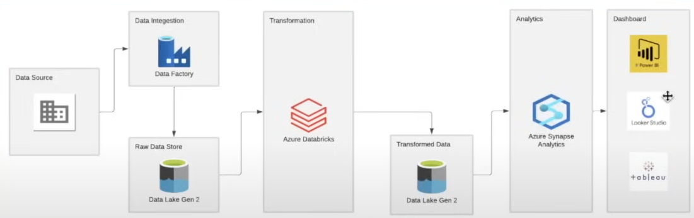
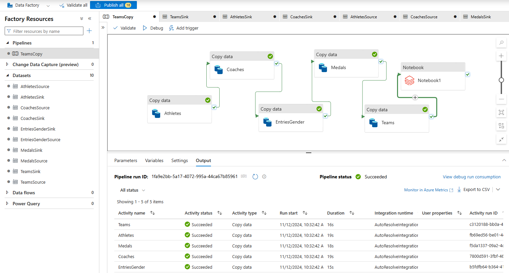
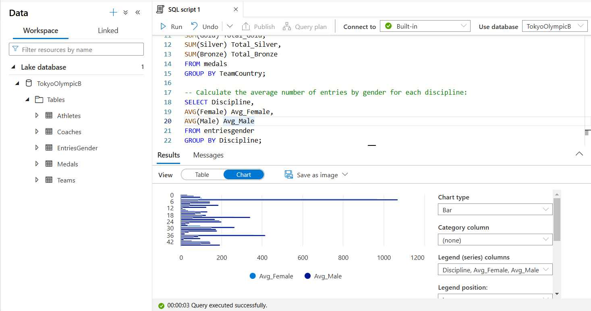
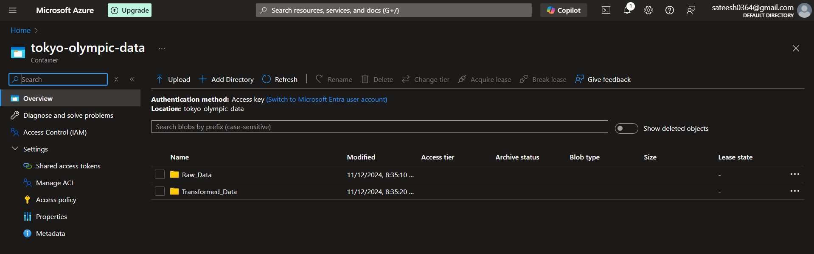

# End-toEnd_Tokyo_Olympic_Azure_Data_Pipeline-
This project focuses on building an end-to-end **data engineering pipeline** using Microsoft Azure services. It demonstrates how to extract, transform, and analyze data by integrating tools like Azure Data Factory, Azure Data Lake # 🏅 Tokyo Olympic Azure Data Engineering Project  

🚀 End-to-End Azure Data Engineering Pipeline using ADF, Databricks, and Synapse Analytics  

---

## 📌 Overview  
This project focuses on building an end-to-end **data engineering pipeline** using Microsoft Azure services. It demonstrates how to extract, transform, and analyze data by integrating tools like Azure Data Factory, Azure Data Lake Gen2, Databricks, and Azure Synapse Analytics.

---

## 💼 Business Use Case  
Designed a scalable data pipeline to simulate real-world sports analytics, enabling organizations to ingest large datasets, transform raw data into structured formats, and generate insights for performance analysis and decision-making.

---

## 🎯 Objective  
- Build a scalable data pipeline on Azure  
- Perform data ingestion, transformation, and analysis  
- Gain hands-on experience with modern data engineering tools  

---

## 🏗️ Architecture  

---

## 🔄 Pipeline  

---

## ⚙️ Workflow  

### 📥 Data Extraction  
- Extracted data from GitHub using HTTP connection  
- Ingested data using **Azure Data Factory (ADF)**  
- Stored raw data in **Azure Data Lake Gen2 (Raw layer)**  

### 🔧 Data Transformation  
- Created mount point in **Databricks** connected to Data Lake  
- Performed data cleaning and transformation using **PySpark**  
- Stored processed data in **Processed layer**  

### 📊 Data Loading & Analytics  
- Created database in **Azure Synapse Analytics**  
- Built tables and views for structured analysis  
- Executed SQL queries to generate insights  

---

## 🛠️ Technologies Used  
- Azure Data Factory  
- Azure Data Lake Gen2  
- Azure Databricks (PySpark)  
- Azure Synapse Analytics  
- SQL  
- PySpark   

---

## 🚀 Key Learnings  
- Built an end-to-end ETL pipeline on Azure  
- Understood data lake architecture (Raw → Processed)  
- Gained hands-on experience with PySpark transformations  
- Performed analytical queries using Synapse Analytics  

---

## 📷 Project Screenshots  

---

## 📌 Future Enhancements  
- Automate pipeline triggers and scheduling  
- Implement data validation and monitoring  
- Add Power BI for visualization layer  Gen2, Databricks, and Azure Synapse Analytics.
